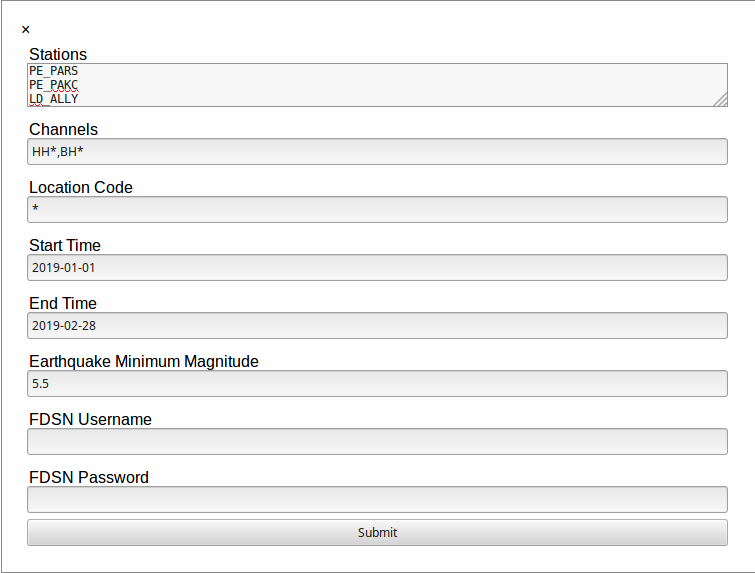
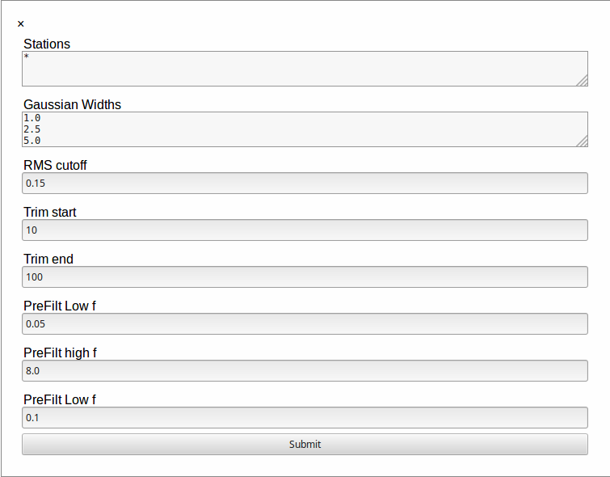

# Under Active Development. Not yet ready for use
# RFPY
RFPY is a tool designed to easily calculate P wave receiver functions using the
iterative deconvolution method of Liggoria and Ammon (1999).  RFPY is created 
using Flask and Obspy.

## Installation
It is recommended to create a virtual environment via venv or conda. Installation
via Ananconda is highlighted below.

**1.** Install the Python 3 version of [Anaconda](https://www.anaconda.com/distribution/) for your operating system

**2.** Create a conda environment containing Obspy
```bash
conda create --name rfpy python=3.7
conda activate rfpy
conda config  --add channels conda-forge
conda install obspy
```
**3.** RFPY can be downloaded via [git](https://git-scm.com/book/en/v2/Getting-Started-Installing-Git)
```bash
git clone https://github.com/khomman/rfpy.git /path/to/rfpy
```
**4.** Install RFPY by
```bash
cd /path/to/rfpy
pip install .
```
or
```bash
cd /path/to/rfpy
python setup.py install
```

## Quick Start
To start using RFPY navigate to a directory you would like to work in and initialize the 
rfpy database.
```bash
rfpy db_init
```
You can now start the rfpy flask app and open a web browser to the [rfpy page](http://127.0.0.1:5000)
```bash
rfpy start
```

## Usage
The first run of rfpy will not contain any data.  Click the Download Data tab
and fill out the form


Once the data has downloaded you can calculate receiver functions by clicking the Calculate RF tab and
editing the form


After calculating the receiver functions you can perform quality control and the hk stack method on the data.

Station, earthquake, and receiver function plots are available at the plots tab.

